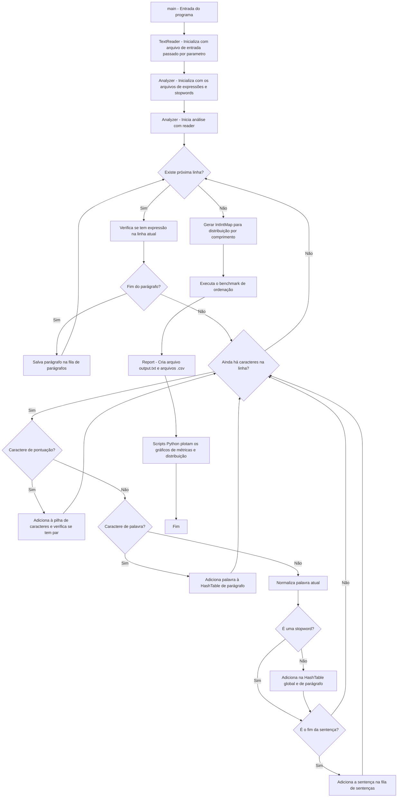

<h1 align='center'>
         🔍 Analisador Léxico-Sintático
</h1>

  
  
  
  
  
  
  
  

Laboratório de Algoritmos e Estruturas de Dados I  
Engenharia de Computação  
Prof. Michel Pires da Silva  
CEFET-MG Campus V  
2026/1  

<h2>📋 Índice</h2>

## 📝 Introdução

Este projeto foi desenvolvido como trabalho de aproveitamento da disciplina de Laboratório de Algorítmos e Estruturas de Dados I (LAEDI), sob a orientação do professor [Michel Pires Silva](https://github.com/mpiress). Este trabalho tem como objetivo principal o desenvolvimento de um sistema denominado Analisador Léxico-Sintático (LSA), capaz de avaliar diferentes métricas associadas à qualidade textual.
O LSA é responsável por processar um texto de entrada e extrair informações estatísticas, estruturais e semânticas sobre seu conteúdo. A partir da leitura sequencial do texto, o sistema identifica palavras (*tokens*), expressões compostas, sentenças, parágrafos e símbolos de pontuação, organizando esses dados por meio de estruturas de dados implementadas manualmente, como:
* Listas encadeadas (LinkedList).
* Pilhas (Stack).
* Filas (Queue).
* Tabelas hash (HashTable).
Todas as estruturas foram implementadas durante o projeto, sem o uso de bibliotecas prontas da Standard Template Library (STL), respeitando as restrições e objetivos didáticos da disciplina aproveitada.
Durante o processamento do texto, o sistema realiza diversas tarefas, entre elas:
* Contagem da frequência de palavras e expressões.
* Identificação de palavras irrelevantes (*stop words*).
* Registro detalhado das ocorrências dos *tokens* (parágrafo, sentença, linha e posição).
* Verificação do balanceamento de símbolos de pontuação.
* Geração de estatísticas por sentença e por parágrafo.
* Construção da distribuição de comprimento das palavras.
Além disso, o sistema incorpora análise de desempenho de algoritmos de ordenação, comparando *MergeSort* e *QuickSort* usando diferentes comparadores e variáveis de ordenação. Para cada algoritmo, são coletadas as seguintes métricas:
* Número de comparações
* Número de trocas
* Tempo de execução
Esses dados e a distribuição por comprimento são exportados no formato `.csv` e posteriormente utilizados para plotagem de gráficos com scripts em Python.
Como parte da automação do projeto, foi desenvolvido pensando na execução em *pipeline* a partir do Makefile, tendo a seguinte ordem:
1. Compilação e criação dos objetos (.o) do código em C++.
2. Execução do analisador sobre o texto de entrada.
3. Geração do ``output.txt`` e dos arquivos `.csv`.
4. Plotagem dos gráficos utilizando ``pandas`` e ``matplolib`` em Python.
Os textos utilizados para testar e analisar o projeto foram Dom Casmurro e a Semana Machado de Assis, ambas obras de Machado de Assis, oferecidas inicialmente para o trabalho de aproveitamento. Estes materiais foram selecionados devido ao tamanho textual e riqueza linguística, possibilitando executar o sistema em um cenário realista e desafiador para análise.
Com este trabalho, busca-se consolidar os conceitos fundamentais da disciplina de LAEDI, demonstrando o conhecimento do autor sobre a disciplina em uma aplicação real, mensurável e extensível.

## 🎯Objetivos

### Objetivo Geral
O objetivo geral deste trabalho é projetar e implementar um Analisador Léxico-Sintático para processamento de texto em linguagem natural, capaz de identificar tokens, sentenças, parágrafos, expressões e padróes sintáticos, utilizando estruturas de dados fundamentais e algoritmos de ordenação, com foco em corretude, elegância e desempenho computacional.
Busca-se aplicar, de forma prática os conceitos de Algoritmos e Estruturas de Dados I, integrando análise léxica, controle sintático básico (balanceamento de símbolos) e geração de estatísticas textuais relevantes, podendo ser relacionado a disciplinas posteriores do curso, como Linguagens de Programação, Linguagens Formais e Autômatos e Compiladores.
#### Métricas de Desempenho
A avaliação do sistema desenvolvido considera os seguintes critérios:
* **Tempo de Execução:**
  Tempo necessário para realizar a análise completa do texto e executar os algoritmos de ordenação, medido em segundos.
* **Uso de Estruturas de Dados:**
  Aplicação correta e elegante de estruturas de dados como pilhas, filas, listas encadeadas e tabelas hash, respeitando suas características.
* **Complexidade assintótica:**
  Análise do comportamento assintótico das principais operações, como inserções em tabelas hash, percursos em listas encadeadas e algoritmos de ordenação (*MergeSort* e *QuickSort*).
* **Qualidade da Análise Textual:**
  Capacidade do sistema em extrair informações léxicas e estruturais relevantes, como frequência de tokens, distribuição de comprimento das palavras e identificação de expressões.

### Objetivos Específicos
* **Implementar um analisador léxico para textos em linguagem natural:**
  Identificar e normalizar tokens (palavras), removendo *stopwords*, tratando abreviações, números e caracteres especiais, além de registrar ocorrências detalhadas (parágrafo, sentença, linha e posição).
* **Realizar análise sintática básica do texto:**
  Verificar o balanceamento de símbolos de pontuação (parênteses, colchetes, chaves, aspas), utilizando estruturas de pilha, identificando inconsistências sintáticas.
* **Organizar informações textuais por sentenças e parágrafos:**
  Estruturar os dados analisados em níveis hierárquicos (texto → parágrafos → sentenças), armazenando estatísticas como número de palavras, palavras sem *stopwords* e comprimento médio, além de facilitar a gestão das estruturas de dados globais, como a listas de tabela hash para tokens e expressões.
* **Detectar e contabilizar expressões pré-definidas:**
  Identificar expressões compostas ao longo do texto, registrando sua frequência e linhas de ocorrência.
* **Construir distribuições estatísticas do texto:**
  Gerar a distribuição de comprimento das palavras, utilizando uma estrutura de mapa (`IntIntMap`) implementada sem dependência da STL.
* **Aplicar e comparar algoritmos de ordenação:**
  Implementar e avaliar *MergeSort* e *QuickSort* para diferentes critérios de ordenação (ordem alfabética e frequência), coletando métricas de comparações, trocas e tempo de execução.
* **Exportar dados para análise externa:**
  Gerar arquivos `.csv` contendo métricas de ordenação e distribuições estatísticas, possibilitando a visualização gráfica por meio de scripts em Python.
* **Documentar o projeto com Doxygen:**
  Produzir documentação técnica completa do código-fonte, incluindo descrição de classes, métodos, parâmetros e estruturas de dados utilizadas.

## 📚 Fundamentação Teórica
O desenvolvimento de um sistema de análise textual eficiente exige a aplicação integrada de conceitos clássicos de estruturas de dados, algoritmos de ordenação e processamento de texto. Este trabalho fundamenta-se nesses pilares para realizar a leitura, organização, análise estatística e apresentação de informações extraídas de textos extensos, respeitando critérios de desempenho e uso eficiente de memória.

A seguir, são apresentados os principais conceitos teóricos que embasam a implementação do sistema proposto.

### Análise léxica (Scanner)
É o processo de decompor um texto ou código-fonte em unidades mínimas e significativas, denominadas *tokens* que são usadas fundamentalmente em compiladores, interpretadores e em processamento de linguagem natural (PLN), para entender a estrutura e significado da entrada.

### Análise sintática (Parser)
Tem como função receber os tokens do analisador léxico e verificar se eles formam uma estrutura gramaticalmente correta, de acordo com as regras da linguagem. Também são fundamentais para compiladores e PLN.

### Pilhas (Stacks)
A pilha é uma estrutura de dados baseada no princípio FILO (First In, Last Out). Os elementos são inseridos e removidos sempre pelo topo.
Neste projeto, pilhas são usadas para:
* Verificar o balanceamento de símbolos de pontuação, como parênteses, colchetes e chaves;
* Garantir a correta correspondência entre símbolos de abertura e fechamento.

### Filas (Queues)
A fila segue o princípio FIFO (First In, First Out), em que o primeiro elemento inserido (enqueue) é o primeiro a ser removido (dequeue).
As filas são empregadas para:
* Armazenar sentenças e parágrafos na ordem em que aparecem no texto;
* Garantir o processamento sequencial correto das estruturas textuais.

### Listas Encadeadas (Linked Lists)
As listas encadeadas permitem inserção e remoção dinâmica de elementos, sem necessidade de realocação contínua de memória. Cada elemento aponta para o próximo, formando uma sequência encadeada.
No contexto deste projeto, as listas encadeadas são utilizadas para:
* Armazenar tokens e expressões;
* Registrar ocorrências (linhas, posições, sentenças);
* Servir como base para estruturas mais complexas.

### Tabelas Hash (Hash Tables)
Tabelas hash são estruturas de dados que permitem acesso rápido a elementos por meio de uma função de dispersão (hash function). Elas oferecem, em média, complexidade de tempo constante para inserção, busca e remoção. A resolução de colisões é feita por encadeamento, utilizando listas encadeadas nos buckets da tabela.
No projeto, tabelas hash são utilizadas para:
* Armazenar tokens (palavras) e suas estatísticas;
* Registrar expressões e suas ocorrências;
* Evitar duplicação de entradas;
* Facilitar consultas rápidas por texto.

### Mapas Associativos
Mapas associativos permitem relacionar chaves a valores. Neste trabalho, foi implementado um mapa específico de inteiros (`IntIntMap`) sem o uso da biblioteca padrão STL.
Esse mapa é utilizado para:
* Construir a distribuição de comprimento das palavras;
* Associar o tamanho da palavra à sua frequência de ocorrência.

### Algoritmos de Ordenação
A ordenação dos dados é essencial para a apresentação organizada dos resultados e para análises comparativas de desempenho.
#### Merge Sort
O Merge Sort é um algoritmo de ordenação baseado na estratégia "dividir para conquistar". Ele divide o vetor em partes menores, ordena cada parte e, em seguida, realiza a fusão ordenada.
Características:
* Complexidade do pior e melhor caso: $$O(n\;log\;n)$$
* Estável
* Custo adicional de memória para copiar o vetor.
* Não há melhora se os elementos já estiverem parcialmente ordenados.
* Não faz troca de elementos, pois eles se ordenam quando as partes se fundem (merge).
#### Quick Sort
O Quick Sort também segue a estratégia de "dividir para conquistar", escolhendo um pivô e particionando o vetor em elementos menores e maiores que ele.
Características:
* Complexidade média: $$O(n\;log\;n)$$
* Pior caso: $$O(n^2)$$
* Instável, pode alterar a ordem dos elementos de mesmo valor.
* Custo de memória extra relacionado a recursão na pilha.
#### Merge Sort X Quick Sort
|Característica|**MergeSort**| **QuickSort**|
|-|-|-|
|**Estratégia**|Dividir  para conquistar|Dividir  para conquistar|
|**Complexidade (Melhor Caso)**|$$O(n\;log\;n)$$|$$O(n\;log\;n)$$|
|**Complexidade (Caso Médio)**|$$O(n\;log\;n)$$|$$O(n\;log\;n)$$|
|**Complexidade (Pior Caso)**|$$O(n\;log\;n)$$|$$O(n^2)$$|
|**Estabilidade**|Estável|Instável|
|**Adapatabilidade**|Não|Sim|
|**Memória extra**|$$O(n)$$|$$O(log\;n)$$|
|**Movimentações (Swaps)**|$$O(n\;log\;n)$$|$$O(n\;log\;n)$$|

**Tabela comparativa das caracteriscas do Merge Sort e do Quick Sort**

## 🔬 Modelagem da Aplicação
A partir do objetivo de desenvolver um sistema analisador léxico-sintático, a modelagem teve como princípio equilibrar o desempenho computacional com a construção de um sistema robusto e modular. O projeto foi implementado em C++, visando eficiência computacional, controle explícito de memória e flexibilidade na implementação de estruturas personalizadas com POO.

A arquitetura do sistema segue uma abordagem modular, na qual cada componente possui responsabilidades bem definidas, facilitando tanto a manutenção quanto a análise individual de desempenho. O fluxo geral da aplicação é coordenado pela função `main`, que orquestra a leitura do texto, a análise léxica, o armazenamento dos dados e a geração dos relatórios e métricas experimentais.

### Fluxo de Execução do Sistema
O funcionamento do analisador pode ser dividido em etapas sequenciais, que refletem o *pipeline* de processamento textual adotado no projeto:
1. **Leitura do Texto de Entrada**
   O sistema inicia com a leitura do arquivo de texto fornecido via linha de comando. Essa etapa é realizada pela classe `TextReader`, responsável por:

   * Abrir e validar o arquivo de entrada;
   * Ler o texto linha a linha;
   * Manter o controle do número da linha atual.
2. **Análise Léxica**
   A etapa central do sistema é conduzida pela classe `Analyzer`, que processa cada linha do texto e executa as seguintes operações:

   * Normalização das palavras (remoção de acentos, conversão para minúsculas, tratamento de caracteres especiais);
   * Identificação e filtragem de *stopwords*, definidas em `stopwords.txt`;
   * Tokenização do texto em palavras (*tokens*);
   * Registro das ocorrências de cada token (parágrafo, sentença, linha e posição);
   * Detecção de sentenças e parágrafos;
   * Verificação do balanceamento de símbolos de pontuação por meio de pilhas;
   * Identificação e contagem de expressões previamente definidas em `expressoes.txt`.
3. **Armazenamento em Estruturas de Dados**
   Ainda na class ``Analyzer``, os dados extraídos durante a análise são armazenados utilizando estruturas implementadas manualmente no projeto, tais como:

   * Tabelas hash para tokens e expressões;
   * Listas encadeadas para armazenar coleções dinâmicas;
   * Filas para preservar a ordem de sentenças e parágrafos;
   * Pilhas para análise de balanceamento de símbolos.
4. **Geração de Relatórios e Exportação de Dados**
   A classe `Report` é responsável por:

   * Gerar relatórios textuais detalhados com os resultados da análise;
   * Exportar métricas de desempenho e distribuições estatísticas em arquivos `.csv`;
   * Produzir dados que posteriormente são utilizados para a geração de gráficos.
5. **Visualização Gráfica (Pós-processamento)**
   Scripts auxiliares em Python utilizam os arquivos `.csv` gerados para:

   * Plotar gráficos de distribuição do comprimento das palavras;
   * Comparar o desempenho dos algoritmos de ordenação em função do tamanho da entrada.

Essa separação permite o desenvolvimento e teste modular da aplicação, além de facilitar a manutenção e refatoração do código, caso necessário.

**Fluxograma de execução do projeto.**

### 📊 Estruturas de Dados

O projeto faz uso extensivo de estruturas de dados implementadas manualmente, evitando o uso direto de containers prontos da STL para fins educacionais. Entre as principais estruturas utilizadas, destacam-se:

* **Lista Encadeada (`LinkedList`)**
  Utilizada como base para diversas outras estruturas, permitindo armazenamento dinâmico de elementos. Utiliza o recurso de templates do C++, tornando-a uma estrutura genérica, podendo listar qualquer tipo de elemento. Possui complexidade de inserção, remoção e acesso de O(n).

* **Tabela Hash (`HashTable`)**
  Empregada para armazenar tokens e expressões, permitindo acesso eficiente por chave textual. Também utiliza de template, porém é generalizada somente para elementos que possuem o método `addOccurrence`. Possui complexidade de inserção e acesso O(1) no melhor caso e O(n) no pior caso, sendo n o tamanho do *bucket*.

* **Fila (`Queue`)**
  Utilizada para manter a ordem de sentenças e parágrafos durante o processamento e a geração de relatórios. Possui complexidade de inserção, acesso e remoção O(1), graças aos ponteiros de `front` e `rear`.

* **Pilha (`Stack`)**
  Aplicada na verificação do balanceamento de símbolos de pontuação, como parênteses e colchetes. Possui complexidade de inserção, acesso e remoção O(1).

* **Mapeamento Inteiro–Inteiro (`IntIntMap`)**
  Utilizado para armazenar distribuições estatísticas, como a frequência de palavras por comprimento. Possui inserção e acesso O(1).

Essas estruturas foram projetadas visando clareza conceitual, eficiência e integração com os algoritmos de ordenação e análise estatística.

### 🚀 Otimizações Propostas

#### Pré-processamento Textual

* Normalização antecipada das palavras para reduzir comparações redundantes;
* Remoção de *stopwords* ainda na fase de análise, reduzindo o volume de dados armazenados.

#### Uso de Hashing

* Utilização de função hash simples e eficiente para distribuição uniforme dos tokens;
* Redução do custo médio de inserção e busca na tabela de símbolos.

#### Análise Empírica de Ordenação

* Execução de múltiplos testes com diferentes tamanhos de entrada;
* Comparação entre MergeSort e QuickSort sob diferentes critérios de ordenação;
* Coleta detalhada de métricas para validação empírica das complexidades assintóticas esperadas.