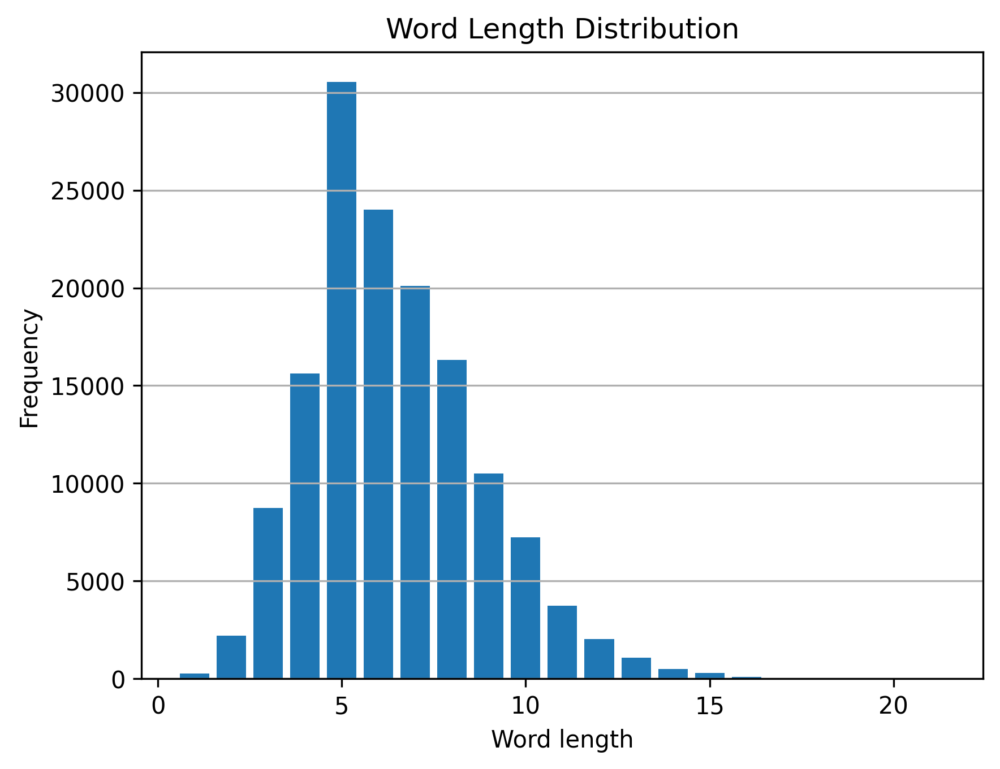
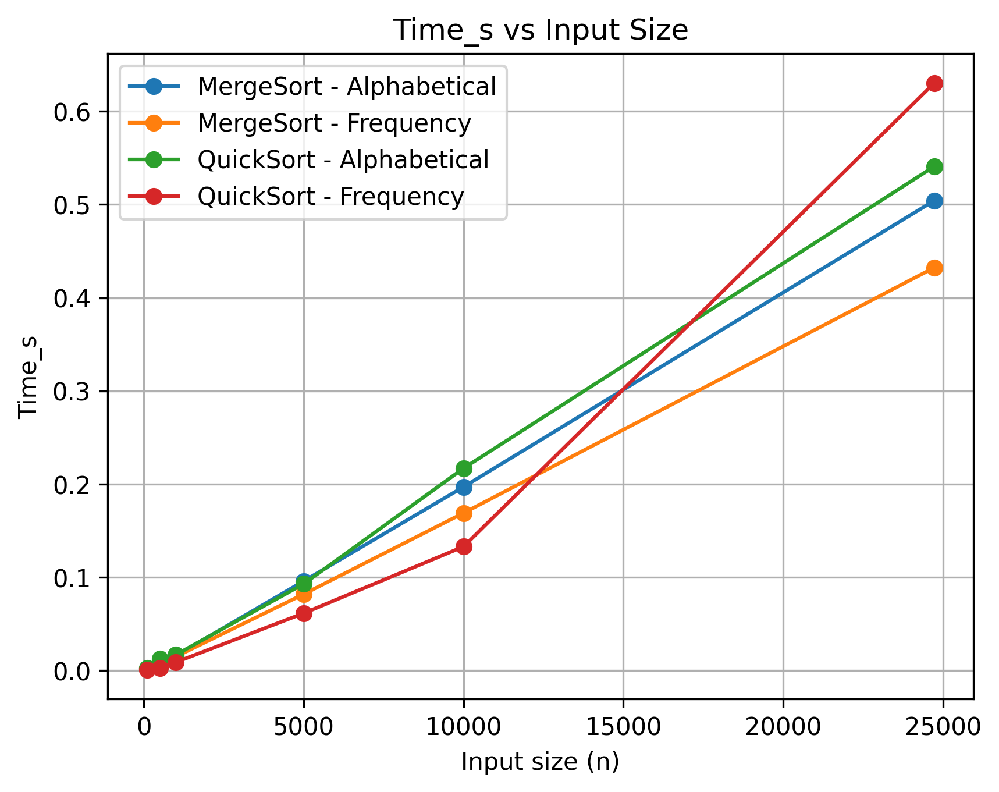
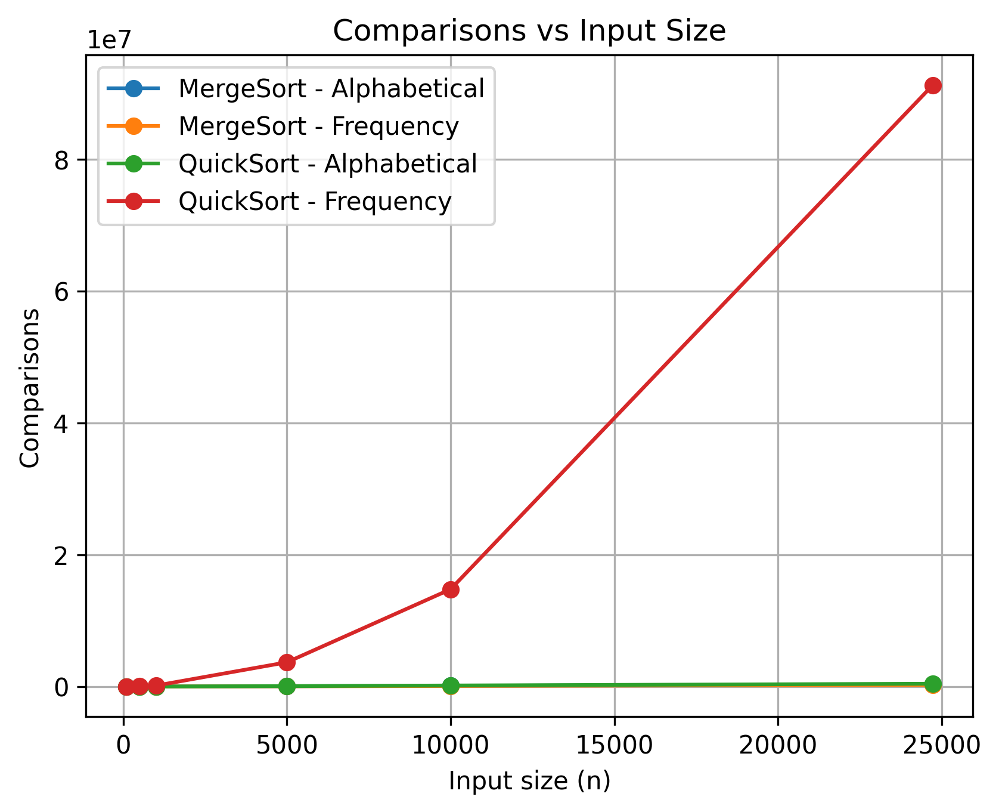
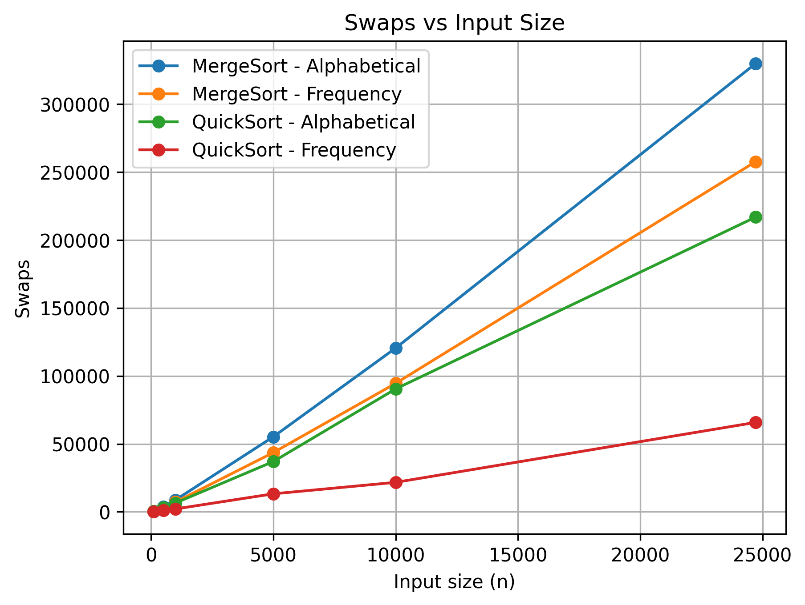

<h1 align='center'>
         🔍 Analisador Léxico-Sintático
</h1>

<p align="center">
  
  
  
  
  
  
  
  

</p>
<div align='center'>
Laboratório de Algoritmos e Estruturas de Dados I <br>
Engenharia de Computação <br>
Prof. Michel Pires da Silva <br>
CEFET-MG Campus V <br>
2026/1  
</div>

---
<details>
<summary><h2>📋 Índice</h2></summary>

* [🔍 Analisador Léxico-Sintático](#-analisador-léxico-sintático)
  * [📝 Introdução](#-introdução)
  * [🎯 Objetivos](#objetivos)
    * [Objetivo Geral](#objetivo-geral)
    * [Objetivos Específicos](#objetivos-específicos)
  * [📚 Fundamentação Teórica](#-fundamentação-teórica)
    * [Análise Léxica](#análise-léxica-scanner)
    * [Análise Sintática](#análise-sintática-parser)
    * [Pilhas](#pilhas-stacks)
    * [Filas](#filas-queues)
    * [Listas Encadeadas](#listas-encadeadas-linked-lists)
    * [Tabelas Hash](#tabelas-hash-hash-tables)
    * [Mapas Associativos](#mapas-associativos)
    * [Algoritmos de Ordenação](#algoritmos-de-ordenação)
      * [MergeSort](#merge-sort)
      * [QuickSort](#quick-sort)
    * [MergeSort X QuickSort](#merge-sort-x-quick-sort)
  * [🔬 Modelagem da Aplicação](#-modelagem-da-aplicação)
    * [Fluxo de Execução do Sistema](#fluxo-de-execução-do-sistema)
    * [📊 Estruturas de Dados](#-estruturas-de-dados)
    * [🚀 Otimizações Propostas](#-otimizações-propostas)
    * [Pré-processamento Textual](#pré-processamento-textual)
    * [Uso de Hashing](#uso-de-hashing)
    * [Análise Empírica de Ordenação](#análise-empírica-de-ordenação)
  * [📝 Metodologia](#-metodologia)
    * [📁 Estrutura do Projeto](#-estrutura-do-projeto)
    * [📁 Arquivos e Diretórios](#-arquivos-e-diretórios)
    * [📚 Bibliotecas](#-bibliotecas)
    * [📌 Bibliotecas do Projeto (Headers Customizados)](#-bibliotecas-do-projeto-headers-customizados)
    * [📌 Bibliotecas Padrão do C++](#-bibliotecas-padrão-do-c)
  * [⚙️ Estruturas de Dados e Implementação do Sistema](#️-estruturas-de-dados-e-implementação-do-sistema)
    * [🧱 Estruturas Base do Sistema](#-estruturas-base-do-sistema)
      * [`struct Occurrence`](#struct-occurrence)
      * [`class Token`](#class-token)
      * [`class Sentence`](#class-sentence)
      * [`class Paragraph`](#class-paragraph)
      * [`class Expression`](#class-expression)
    * [🧱 Estruturas de Dados Genéricas](#-estruturas-de-dados-genéricas)
      * [`struct Node<T>`](#struct-nodet)
      * [`class Stack<T>`](#class-stackt)
      * [`class Queue<T>`](#class-queuet)
      * [`class LinkedList<T>`](#class-linkedlistt)
      * [`class HashTable<T>`](#class-hashtablet)
    * [🗺️ Estruturas Auxiliares de Mapeamento](#️-estruturas-auxiliares-de-mapeamento)
      * [`struct MapEntry`](#struct-mapentry)
      * [`class IntIntMap`](#class-intintmap)
    * [🔀 Estruturas de Comparação e Ordenação](#-estruturas-de-comparação-e-ordenação)
      * [Funções de Comparação para `Expression`](#funções-de-comparação-para-expression-expressioncomparatorshpp)
      * [Funções de Comparação para `Token`](#funções-de-comparação-para-token-tokencomparatorshpp)
      * [Funções de Comparação para `MapEntry`](#funções-de-comparação-para-mapentry-mapentrycomparatorshpp)
      * [`struct SortMetrics`](#struct-sortmetrics)
      * [`class Sorter<T>`](#class-sortert)
    * [📖 Leitura de Texto e Análise Léxico-Sintática](#-leitura-de-texto-e-análise-léxico-sintática)
      * [`class TextReader`](#class-textreader)
      * [ `class Analyzer`](#class-analyzer)
    * [📜 Saídas do Algoritmo](#-saídas-do-algoritmo)
      * [`class Report`](#class-report)
      * [Função `main`](#função-main)
    * [📊 Scripts em Python](#-scripts-em-python)
      * [`plot_utils.py`](#plot_utilspy)
      * [`plot_length_dist.py`](#plot_length_distpy)
      * [`plot_sort_metrics.py`](#plot_sort_metricspy)
  * [🧮 Resultados](#-resultados)
    * [Exemplo de Saída do Analisador](#exemplo-de-saída-do-analisador)
    * [Distribuição por comprimento das palavras](#distribuição-por-comprimento-das-palavras)
    * [Desempenho dos algoritmos de ordenação](#desempenho-dos-algoritmos-de-ordenação)
      * [Tempo de Execução](#tempo-de-execução)
      * [Comparações e trocas](#comparações-e-trocas)
    * [Comparação com análise assintótica](#comparação-com-análise-assintótica)
  * [🏁 Conclusão](#-conclusão)
  * [🖥️ Hardware Utilizado](#️-hardware-utilizado)
  * [🔧 Configuração do Ambiente](#-configuração-do-ambiente)
  * [💻 Como Compilar e Executar](#-como-compilar-e-executar)
    * [Clone do Repositório](#clone-do-repositório)
    * [Pré-requisitos](#pré-requisitos)
    * [Compilação](#compilação)
    * [Execução](#execução)
    * [Geração de Gráficos](#geração-de-gráficos)
  * [👤 Autoria](#-autoria)
    * [Autor do Projeto](#autor-do-projeto)
    * [Estatísticas do Repositório](#estatísticas-do-repositório)
  * [📚 Referências](#-referências)
</details>

---
## 📝 Introdução

Este projeto foi desenvolvido como trabalho de aproveitamento da disciplina de Laboratório de Algorítmos e Estruturas de Dados I (LAEDI), sob a orientação do professor [Michel Pires Silva](https://github.com/mpiress). Este trabalho tem como objetivo principal o desenvolvimento de um sistema denominado Analisador Léxico-Sintático (LSA), capaz de avaliar diferentes métricas associadas à qualidade textual.
O LSA é responsável por processar um texto de entrada e extrair informações estatísticas, estruturais e semânticas sobre seu conteúdo. A partir da leitura sequencial do texto, o sistema identifica palavras (*tokens*), expressões compostas, sentenças, parágrafos e símbolos de pontuação, organizando esses dados por meio de estruturas de dados implementadas manualmente, como:
* Listas encadeadas (LinkedList).
* Pilhas (Stack).
* Filas (Queue).
* Tabelas hash (HashTable).

Todas as estruturas foram implementadas durante o projeto, sem o uso de bibliotecas prontas da Standard Template Library (STL), respeitando as restrições e objetivos didáticos da disciplina aproveitada.
Durante o processamento do texto, o sistema realiza diversas tarefas, entre elas:
* Contagem da frequência de palavras e expressões.
* Identificação de palavras irrelevantes (*stop words*).
* Registro detalhado das ocorrências dos *tokens* (parágrafo, sentença, linha e posição).
* Verificação do balanceamento de símbolos de pontuação.
* Geração de estatísticas por sentença e por parágrafo.
* Construção da distribuição de comprimento das palavras.

Além disso, o sistema incorpora análise de desempenho de algoritmos de ordenação, comparando *MergeSort* e *QuickSort* usando diferentes comparadores e variáveis de ordenação. Para cada algoritmo, são coletadas as seguintes métricas:
* Número de comparações
* Número de trocas
* Tempo de execução

Esses dados e a distribuição por comprimento são exportados no formato `.csv` e posteriormente utilizados para plotagem de gráficos com scripts em Python.
Como parte da automação do projeto, foi desenvolvido pensando na execução em *pipeline* a partir do Makefile, tendo a seguinte ordem:
1. Compilação e criação dos objetos (.o) do código em C++.
2. Execução do analisador sobre o texto de entrada.
3. Geração do ``output.txt`` e dos arquivos `.csv`.
4. Plotagem dos gráficos utilizando ``pandas`` e ``matplolib`` em Python.

Os textos utilizados para testar e analisar o projeto foram Dom Casmurro e a Semana Machado de Assis, ambas obras de Machado de Assis, oferecidas inicialmente para o trabalho de aproveitamento. Estes materiais foram selecionados devido ao tamanho textual e riqueza linguística, possibilitando executar o sistema em um cenário realista e desafiador para análise.
Com este trabalho, busca-se consolidar os conceitos fundamentais da disciplina de LAEDI, demonstrando o conhecimento do autor sobre a disciplina em uma aplicação real, mensurável e extensível.

---
## 🎯Objetivos

### Objetivo Geral
O objetivo geral deste trabalho é projetar e implementar um Analisador Léxico-Sintático para processamento de texto em linguagem natural, capaz de identificar tokens, sentenças, parágrafos, expressões e padróes sintáticos, utilizando estruturas de dados fundamentais e algoritmos de ordenação, com foco em corretude, elegância e desempenho computacional.
Busca-se aplicar, de forma prática os conceitos de Algoritmos e Estruturas de Dados I, integrando análise léxica, controle sintático básico (balanceamento de símbolos) e geração de estatísticas textuais relevantes, podendo ser relacionado a disciplinas posteriores do curso, como Linguagens de Programação, Linguagens Formais e Autômatos e Compiladores.
#### Métricas de Desempenho
A avaliação do sistema desenvolvido considera os seguintes critérios:
* **Tempo de Execução:**
  Tempo necessário para realizar a análise completa do texto e executar os algoritmos de ordenação, medido em segundos.
* **Uso de Estruturas de Dados:**
  Aplicação correta e elegante de estruturas de dados como pilhas, filas, listas encadeadas e tabelas hash, respeitando suas características.
* **Complexidade assintótica:**
  Análise do comportamento assintótico das principais operações, como inserções em tabelas hash, percursos em listas encadeadas e algoritmos de ordenação (*MergeSort* e *QuickSort*).
* **Qualidade da Análise Textual:**
  Capacidade do sistema em extrair informações léxicas e estruturais relevantes, como frequência de tokens, distribuição de comprimento das palavras e identificação de expressões.

### Objetivos Específicos
* **Implementar um analisador léxico para textos em linguagem natural:**
  Identificar e normalizar tokens (palavras), removendo *stopwords*, tratando abreviações, números e caracteres especiais, além de registrar ocorrências detalhadas (parágrafo, sentença, linha e posição).
* **Realizar análise sintática básica do texto:**
  Verificar o balanceamento de símbolos de pontuação (parênteses, colchetes, chaves, aspas), utilizando estruturas de pilha, identificando inconsistências sintáticas.
* **Organizar informações textuais por sentenças e parágrafos:**
  Estruturar os dados analisados em níveis hierárquicos (texto → parágrafos → sentenças), armazenando estatísticas como número de palavras, palavras sem *stopwords* e comprimento médio, além de facilitar a gestão das estruturas de dados globais, como a listas de tabela hash para tokens e expressões.
* **Detectar e contabilizar expressões pré-definidas:**
  Identificar expressões compostas ao longo do texto, registrando sua frequência e linhas de ocorrência.
* **Construir distribuições estatísticas do texto:**
  Gerar a distribuição de comprimento das palavras, utilizando uma estrutura de mapa (`IntIntMap`) implementada sem dependência da STL.
* **Aplicar e comparar algoritmos de ordenação:**
  Implementar e avaliar *MergeSort* e *QuickSort* para diferentes critérios de ordenação (ordem alfabética e frequência), coletando métricas de comparações, trocas e tempo de execução.
* **Exportar dados para análise externa:**
  Gerar arquivos `.csv` contendo métricas de ordenação e distribuições estatísticas, possibilitando a visualização gráfica por meio de scripts em Python.
* **Documentar o projeto com Doxygen:**
  Produzir documentação técnica completa do código-fonte, incluindo descrição de classes, métodos, parâmetros e estruturas de dados utilizadas.

---
## 📚 Fundamentação Teórica
O desenvolvimento de um sistema de análise textual eficiente exige a aplicação integrada de conceitos clássicos de estruturas de dados, algoritmos de ordenação e processamento de texto. Este trabalho fundamenta-se nesses pilares para realizar a leitura, organização, análise estatística e apresentação de informações extraídas de textos extensos, respeitando critérios de desempenho e uso eficiente de memória.

A seguir, são apresentados os principais conceitos teóricos que embasam a implementação do sistema proposto.

---
### Análise léxica (Scanner)
É o processo de decompor um texto ou código-fonte em unidades mínimas e significativas, denominadas *tokens* que são usadas fundamentalmente em compiladores, interpretadores e em processamento de linguagem natural (PLN), para entender a estrutura e significado da entrada.

---
### Análise sintática (Parser)
Tem como função receber os tokens do analisador léxico e verificar se eles formam uma estrutura gramaticalmente correta, de acordo com as regras da linguagem. Também são fundamentais para compiladores e PLN.

---
### Pilhas (Stacks)
A pilha é uma estrutura de dados baseada no princípio FILO (First In, Last Out). Os elementos são inseridos e removidos sempre pelo topo.
Neste projeto, pilhas são usadas para:
* Verificar o balanceamento de símbolos de pontuação, como parênteses, colchetes e chaves;
* Garantir a correta correspondência entre símbolos de abertura e fechamento.

---
### Filas (Queues)
A fila segue o princípio FIFO (First In, First Out), em que o primeiro elemento inserido (enqueue) é o primeiro a ser removido (dequeue).
As filas são empregadas para:
* Armazenar sentenças e parágrafos na ordem em que aparecem no texto;
* Garantir o processamento sequencial correto das estruturas textuais.

---
### Listas Encadeadas (Linked Lists)
As listas encadeadas permitem inserção e remoção dinâmica de elementos, sem necessidade de realocação contínua de memória. Cada elemento aponta para o próximo, formando uma sequência encadeada.
No contexto deste projeto, as listas encadeadas são utilizadas para:
* Armazenar tokens e expressões;
* Registrar ocorrências (linhas, posições, sentenças);
* Servir como base para estruturas mais complexas.

---
### Tabelas Hash (Hash Tables)
Tabelas hash são estruturas de dados que permitem acesso rápido a elementos por meio de uma função de dispersão (hash function). Elas oferecem, em média, complexidade de tempo constante para inserção, busca e remoção. A resolução de colisões é feita por encadeamento, utilizando listas encadeadas nos buckets da tabela.
No projeto, tabelas hash são utilizadas para:
* Armazenar tokens (palavras) e suas estatísticas;
* Registrar expressões e suas ocorrências;
* Evitar duplicação de entradas;
* Facilitar consultas rápidas por texto.

---
### Mapas Associativos
Mapas associativos permitem relacionar chaves a valores. Neste trabalho, foi implementado um mapa específico de inteiros (`IntIntMap`) sem o uso da biblioteca padrão STL.
Esse mapa é utilizado para:
* Construir a distribuição de comprimento das palavras;
* Associar o tamanho da palavra à sua frequência de ocorrência.

---
### Algoritmos de Ordenação
A ordenação dos dados é essencial para a apresentação organizada dos resultados e para análises comparativas de desempenho.

---
#### Merge Sort
O Merge Sort é um algoritmo de ordenação baseado na estratégia "dividir para conquistar". Ele divide o vetor em partes menores, ordena cada parte e, em seguida, realiza a fusão ordenada.
Características:
* Complexidade do pior e melhor caso: $$O(n\;log\;n)$$
* Estável
* Custo adicional de memória para copiar o vetor.
* Não há melhora se os elementos já estiverem parcialmente ordenados.
* Não faz troca de elementos, pois eles se ordenam quando as partes se fundem (merge).

---
#### Quick Sort
O Quick Sort também segue a estratégia de "dividir para conquistar", escolhendo um pivô e particionando o vetor em elementos menores e maiores que ele.
Características:
* Complexidade média: $$O(n\;log\;n)$$
* Pior caso: $$O(n^2)$$
* Instável, pode alterar a ordem dos elementos de mesmo valor.
* Custo de memória extra relacionado a recursão na pilha.

---
#### Merge Sort X Quick Sort
|Característica|**MergeSort**| **QuickSort**|
|-|-|-|
|**Estratégia**|Dividir  para conquistar|Dividir  para conquistar|
|**Complexidade (Melhor Caso)**|$$O(n\;log\;n)$$|$$O(n\;log\;n)$$|
|**Complexidade (Caso Médio)**|$$O(n\;log\;n)$$|$$O(n\;log\;n)$$|
|**Complexidade (Pior Caso)**|$$O(n\;log\;n)$$|$$O(n^2)$$|
|**Estabilidade**|Estável|Instável|
|**Adapatabilidade**|Não|Sim|
|**Memória extra**|$$O(n)$$|$$O(log\;n)$$|
|**Movimentações (Swaps)**|$$O(n\;log\;n)$$|$$O(n\;log\;n)$$|
> **Tabela 1 - Comparativo das caracteriscas do Merge Sort e do Quick Sort.**

---
## 🔬 Modelagem da Aplicação
A partir do objetivo de desenvolver um sistema analisador léxico-sintático, a modelagem teve como princípio equilibrar o desempenho computacional com a construção de um sistema robusto e modular. O projeto foi implementado em C++, visando eficiência computacional, controle explícito de memória e flexibilidade na implementação de estruturas personalizadas com POO.

A arquitetura do sistema segue uma abordagem modular, na qual cada componente possui responsabilidades bem definidas, facilitando tanto a manutenção quanto a análise individual de desempenho. O fluxo geral da aplicação é coordenado pela função `main`, que orquestra a leitura do texto, a análise léxica, o armazenamento dos dados e a geração dos relatórios e métricas experimentais.

---
### Fluxo de Execução do Sistema
O funcionamento do analisador pode ser dividido em etapas sequenciais, que refletem o *pipeline* de processamento textual adotado no projeto:
1. **Leitura do Texto de Entrada**
   O sistema inicia com a leitura do arquivo de texto fornecido via linha de comando. Essa etapa é realizada pela classe `TextReader`, responsável por:

   * Abrir e validar o arquivo de entrada;
   * Ler o texto linha a linha;
   * Manter o controle do número da linha atual.
2. **Análise Léxica**
   A etapa central do sistema é conduzida pela classe `Analyzer`, que processa cada linha do texto e executa as seguintes operações:

   * Normalização das palavras (remoção de acentos, conversão para minúsculas, tratamento de caracteres especiais);
   * Identificação e filtragem de *stopwords*, definidas em `stopwords.txt`;
   * Tokenização do texto em palavras (*tokens*);
   * Registro das ocorrências de cada token (parágrafo, sentença, linha e posição);
   * Detecção de sentenças e parágrafos;
   * Verificação do balanceamento de símbolos de pontuação por meio de pilhas;
   * Identificação e contagem de expressões previamente definidas em `expressoes.txt`.
3. **Armazenamento em Estruturas de Dados**
   Ainda na class ``Analyzer``, os dados extraídos durante a análise são armazenados utilizando estruturas implementadas manualmente no projeto, tais como:

   * Tabelas hash para tokens e expressões;
   * Listas encadeadas para armazenar coleções dinâmicas;
   * Filas para preservar a ordem de sentenças e parágrafos;
   * Pilhas para análise de balanceamento de símbolos.
4. **Geração de Relatórios e Exportação de Dados**
   A classe `Report` é responsável por:

   * Gerar relatórios textuais detalhados com os resultados da análise;
   * Exportar métricas de desempenho e distribuições estatísticas em arquivos `.csv`;
   * Produzir dados que posteriormente são utilizados para a geração de gráficos.
5. **Visualização Gráfica (Pós-processamento)**
   Scripts auxiliares em Python utilizam os arquivos `.csv` gerados para:

   * Plotar gráficos de distribuição do comprimento das palavras;
   * Comparar o desempenho dos algoritmos de ordenação em função do tamanho da entrada.

Essa separação permite o desenvolvimento e teste modular da aplicação, além de facilitar a manutenção e refatoração do código, caso necessário.

**Fluxograma de execução do projeto.**

---
### 📊 Estruturas de Dados

O projeto faz uso extensivo de estruturas de dados implementadas manualmente, evitando o uso direto de containers prontos da STL para fins educacionais. Entre as principais estruturas utilizadas, destacam-se:

* **Lista Encadeada (`LinkedList`)**
  Utilizada como base para diversas outras estruturas, permitindo armazenamento dinâmico de elementos. Utiliza o recurso de templates do C++, tornando-a uma estrutura genérica, podendo listar qualquer tipo de elemento. Possui complexidade de inserção, remoção e acesso de O(n).

* **Tabela Hash (`HashTable`)**
  Empregada para armazenar tokens e expressões, permitindo acesso eficiente por chave textual. Também utiliza de template, porém é generalizada somente para elementos que possuem o método `addOccurrence`. Possui complexidade de inserção e acesso O(1) no melhor caso e O(n) no pior caso, sendo n o tamanho do *bucket*.

* **Fila (`Queue`)**
  Utilizada para manter a ordem de sentenças e parágrafos durante o processamento e a geração de relatórios. Possui complexidade de inserção, acesso e remoção O(1), graças aos ponteiros de `front` e `rear`.

* **Pilha (`Stack`)**
  Aplicada na verificação do balanceamento de símbolos de pontuação, como parênteses e colchetes. Possui complexidade de inserção, acesso e remoção O(1).

* **Mapeamento Inteiro–Inteiro (`IntIntMap`)**
  Utilizado para armazenar distribuições estatísticas, como a frequência de palavras por comprimento. Possui inserção e acesso O(1).

Essas estruturas foram projetadas visando clareza conceitual, eficiência e integração com os algoritmos de ordenação e análise estatística.

---
### 🚀 Otimizações Propostas

#### Pré-processamento Textual

* Normalização antecipada das palavras para reduzir comparações redundantes;
* Remoção de *stopwords* ainda na fase de análise, reduzindo o volume de dados armazenados.

#### Uso de Hashing

* Utilização de função hash simples e eficiente para distribuição uniforme dos tokens;
* Redução do custo médio de inserção e busca na tabela de símbolos.

#### Análise Empírica de Ordenação

* Execução de múltiplos testes com diferentes tamanhos de entrada;
* Comparação entre MergeSort e QuickSort sob diferentes critérios de ordenação;
* Coleta detalhada de métricas para validação empírica das complexidades assintóticas esperadas.

---
## 📝 Metodologia
A implementação do sistema de análise léxica e sintática foram feitas em C++, uitilizando a IDE Visual Studio Code para desenvolvimento do código-fonte e uso do Github para controle de versão. O projeto foi organizado em um repositório, contendo diretórios dividindo os arquivos de cabeçalho (.hpp) em ``include``, arquivos de implementação (.cpp) em ``src``, arquivos de entrada em ``data``, scripts em Python no diretório ``utils``, diretório de saída ``output``, além de outros diretórios auxiliares.

---
## 📁 Estrutura do Projeto
A seguir, a estrutura do diretório do projeto, organizada para separar o código-fonte, os dados e os resultados:
```
.
│
├── bin/
|   └── LSA
│
├── data/
│   ├── DomCasmurro.txt
│   ├── expressoes.txt
│   ├── output.txt
|   ├── Semana_Machado_Assis.txt
│   └── stopwords.txt
│
├── include/
│   ├── Analyzer.hpp
│   ├── Expression.hpp
│   ├── ExpressionComparators.hpp
│   ├── HashTable.hpp
│   ├── IntIntMap.hpp
│   ├── LinkedList.hpp
│   ├── MapEntry.hpp
│   ├── MapEntryComparators.hpp
│   ├── Node.hpp
│   ├── Occurrence.hpp
│   ├── Paragraph.hpp
│   ├── Queue.hpp
│   ├── Report.hpp
│   ├── Sentence.hpp
│   ├── Sorter.hpp
│   ├── SortMetrics.hpp
│   ├── Stack.hpp
│   ├── TextReader.hpp
│   ├── Token.hpp
|   └── TokenComparators.hpp
│
├── output/
│   ├── length_dist.csv
│   ├── length_distribution.png
│   ├── output.txt
│   ├── sort_metrics.csv
│   ├── sort_performance_comparisons.png
│   ├── sort_performance_swaps.png
│   └── sort_performance_time.png
|
├── src/
│   ├── Analyzer.cpp
│   ├── Expression.cpp
│   ├── IntIntMap.cpp
│   ├── main.cpp
│   ├── Paragraph.cpp
│   ├── Report.cpp
│   ├── Sentence.cpp
│   ├── TextReader.cpp
│   └── Token.cpp
│
├── utils/
│   ├── plot_length.py
│   ├── plot_sort_metrics.py
│   └── plot_utils.py
|
├── .gitignore
├── Doxyfile
├── LICENSE
├── Makefile
└── README.md
```

---
### 📁 Arquivos e Diretórios
A seguir, são descritos os principais arquivos e diretórios do projeto, detalhando suas responsabilidades no processo de análise léxica e sintática.
* **`bin/`**
  Contém o executável final do projeto após a compilação.
  * `LSA`: executável do *Lexical-Syntactic Analyzer*.
* **`data/`**
  Diretório que armazena os arquivos de entrada utilizados na análise textual:
  * `DomCasmurro.txt`: texto literário utilizado como base principal para análise.
  * `expressoes.txt`: arquivo contendo expressões específicas a serem identificadas no texto.
  * `output.txt`: arquivo de exemplo utilizado para montar o ``output.txt`` do projeto.
  * `Semana_Machado_Assis.txt`: texto alternativo para testes comparativos.
  * `stopwords.txt`: lista de palavras irrelevantes (artigos, preposições etc.) removidas durante a análise léxica.
* **`include/`**
  Contém todos os arquivos de cabeçalho (`.hpp`), responsáveis pela definição das estruturas de dados, classes, classes template e interfaces do sistema.
* **`src/`**
  Contém os arquivos de implementação (`.cpp`) correspondentes aos cabeçalhos definidos em `include/`.
* **`output/`**
  Diretório de saída que armazena os resultados da execução do analisador, incluindo arquivos de texto, métricas e gráficos gerados:
  * `output.txt`: relatório textual com os resultados da análise léxica e sintática.
  * `length_dist.csv`: distribuição de tokens por comprimento.
  * `sort_metrics.csv`: métricas coletadas durante os algoritmos de ordenação.
  * Arquivos `.png`: gráficos de desempenho e análise estatística.
* **`utils/`**
  Scripts auxiliares em Python utilizados para plotagem de gráficos e análise visual dos dados:
  * `plot_length.py`: gera gráfico da distribuição de comprimentos dos tokens.
  * `plot_sort_metrics.py`: gera gráficos comparativos de desempenho dos algoritmos de ordenação.
  * `plot_utils.py`: funções auxiliares comuns aos scripts de plotagem.

---
### 📚 Bibliotecas
A implementação do Analisador Léxico e Sintático não utiliza das estruturas de dados do STL, porém utiliza de outras bibliotecas padrões do C++. As principais bibliotecas são:

---
### 📌 Bibliotecas do Projeto (Headers Customizados)
Os principais arquivos de cabeçalho desenvolvidos no projeto são:
* **`Analyzer.hpp`**
  Define a classe central do sistema, responsável por orquestrar a análise léxica e sintática, integrando a leitura do texto, tokenização, filtragem de *stopwords*, identificação de expressões e geração dos relatórios finais.
* **`TextReader.hpp`**
  Responsável pela leitura dos arquivos de entrada e controle da linha atual e o número da linha.
* **`Token.hpp`**
  Define a estrutura de um token léxico, contendo informações como o texto, e a lista de ocorrencias do token.
* **`Sentence.hpp`** e **`Paragraph.hpp`**
  Representam a organização hierárquica do texto, permitindo armazenar informações de sentenças e parágrafos para uso posterior em fila.

* **`Expression.hpp`**
  Representa expressões compostas detectadas no texto, com uma lista de linhas onde foram encontradas determinada expressão..

* **`Occurrence.hpp`**
  Armazena informações sobre as ocorrências de tokens, como sentença, parágrafo, linha e posição.

* **`HashTable.hpp`**
  Implementações customizadas de tabelas hash genérico apenas para objetos com método `addOccurrence`.

* *`IntIntMap.hpp`**
  Implementação de mapa de inteiro para inteiro, utilizado para calcular distribuição por comprimento dos tokens do texto de entrada.

* *`Node.hpp`**
  Implementação de nó simples genérico, contendo o dado template `T` e o ponteiro para próximo nó.

* **`LinkedList.hpp`**
  Implementa listas encadeadas genéricas utilizadas para armazenar coleções dinâmicas de tokens, expressões e ocorrências.

* **`Stack.hpp`** e **`Queue.hpp`**
  Estruturas auxiliares empregadas em etapas específicas da análise sintática e no controle de fluxo de dados.

* **`Sorter.hpp`**
  Implementa os dois algoritmos de ordenação selecionados, aplicados aos tokens, expressões e entradas do mapa, permitindo a análise de desempenho conforme critérios alfabéticos e por frequência.

* **`SortMetrics.hpp`**
  Estrutura responsável por coletar métricas de desempenho dos algoritmos de ordenação, como número de comparações, trocas e tempo de execução.

* **`Report.hpp`**
  Responsável pela consolidação dos resultados da análise e pela geração dos arquivos de saída em formato textual.

* **Arquivos de Comparadores (`ExpressionComparators.hpp`, `TokenComparators.hpp`, `MapEntryComparators.hpp`)**
  Definem critérios personalizados de comparação utilizados nos processos de ordenação e ranqueamento.

---
### 📌 Bibliotecas Padrão do C++

A seguir estão listadas as principais bibliotecas padrão do C++ utilizadas no projeto:

* **`iostream`**
  Utilizada para entrada e saída de dados no console, especialmente para mensagens de execução e depuração.

* **`fstream`**
  Empregada na leitura dos arquivos de entrada (`.txt`) e na escrita dos arquivos de saída gerados pelo analisador.

* **`string`**
  Essencial para a manipulação de cadeias de caracteres durante a tokenização e análise léxica.

* **`chrono`**
  Utilizado para medição precisa do tempo de execução dos algoritmos de ordenação, permitindo a análise de desempenho.

* **`cctype`**
  Utilizado para classificação de caracteres durante a análise léxica (letras, dígitos, pontuação, etc.).

* **`iomanip`**
  Utilizado para formatação da saída de dados numéricos nos relatórios.

* **`cstdlib`** e **`cstring`**
  Utilizados para operações básicas de conversão e manipulação de dados em baixo nível quando necessário.

---
## ⚙️ Estruturas de Dados e Implementação do Sistema
Nesta seção são descritas e explicadas as classes e estruturas de dados desenvolvidas para o projeto, evidenciando seus atributos e métodos.

---
### 🧱 Estruturas Base do Sistema

---
#### `struct Occurrence`
Representa uma ocorrência individual de um token no texto.

**Atributos:**
* `paragraph`: Número do parágrafo onde ocorre.
* `sentence`: Número da sentença onde ocorre.
* `line`: Número da linha onde ocorre.
* `position`: Posição do token dentro da sentença.

**Métodos:**
* `Occurrence(int p, int s, int l, int pos)`: Construtor que inicializa todos os campos posicionais da ocorrência.

---
#### `class Token`
Representa um token léxico (palavra) extraído do texto.

**Atributos:**
* `text`: Texto do token.
* `frequency`: Número total de ocorrências do token no texto.
* `occurrences`: Lista encadeada contendo todas as ocorrências do token.

**Métodos:**
* `Token()`: Construtor padrão.
* `Token(const string &t)`: Construtor que inicializa o token com um texto específico.
* `Token(const Token &other)`: Construtor de cópia.
* `Token& operator=(const Token &other)`: Operador de atribuição para cópia de tokens.
* `addOccurrence(int p, int s, int l, int pos)`: Registra uma nova ocorrência do token, atualizando a frequência.
* `getText()`: Retorna o texto do token.
* `getFrequency()`: Retorna a frequência total do token.
* `getOccurrences()`: Retorna a lista de ocorrências associadas ao token.

---
#### `class Sentence`
Armazena informações estatísticas associadas a uma sentença do texto.

**Atributos:**
* `paragraphNumber`: Número do parágrafo ao qual a sentença pertence.
* `sentenceNumber`: Índice da sentença dentro do parágrafo.
* `stopWords`: Quantidade de *stopwords* na sentença.
* `nonStopWords`: Quantidade de palavras relevantes na sentença.
* `averageWordLength`: Comprimento médio das palavras da sentença.

**Métodos:**
* `Sentence()`: Construtor padrão.
* `Sentence(int pN, int sN, int sWords, int nWords, double avrWordLength)`: Construtor que inicializa todas as métricas da sentença.
* `getParagraphNumber()`: Retorna o número do parágrafo.
* `getSentenceNumber()`: Retorna o número da sentença.
* `getAllWords()`: Retorna o total de palavras da sentença (com e sem *stopwords*).
* `getNormalWords()`: Retorna o número de palavras não consideradas *stopwords*.
* `getAverageWordLength()`: Retorna o comprimento médio das palavras.

---
#### `class Paragraph`
Representa um parágrafo do texto analisado.

**Atributos:**
* `number`: Número sequencial do parágrafo no texto.
* `startingLine`: Número da linha onde o parágrafo se inicia.
* `totalSentences`: Quantidade de sentenças no parágrafo.

**Métodos:**
* `Paragraph()`: Construtor padrão.
* `Paragraph(int n, int sL, int tS)`: Construtor que inicializa os metadados do parágrafo.
* `getNumber()`: Retorna o número do parágrafo.
* `getStartingLine()`: Retorna a linha inicial do parágrafo.
* `getTotalSentences()`: Retorna o número total de sentenças.

---
#### `class Expression`
Representa uma expressão composta por múltiplas palavras.

**Atributos:**
* `text`: Texto completo da expressão.
* `frequency`: Número de ocorrências da expressão no texto.
* `lines`: Lista encadeada contendo as linhas onde a expressão ocorre.

**Métodos:**
* `Expression()`: Construtor padrão.
* `Expression(const string &t)`: Construtor que inicializa a expressão com um texto específico.
* `Expression(const Expression &other)`: Construtor de cópia.
* `Expression& operator=(const Expression &other)`: Operador de atribuição.
* `addOccurrence(int line)`: Registra uma nova ocorrência da expressão.
* `getText()`: Retorna o texto da expressão.
* `getFrequency()`: Retorna a frequência da expressão.
* `getLines()`: Retorna a lista de linhas onde a expressão ocorre.

---
### 🧱 Estruturas de Dados Genéricas

---
#### `struct Node<T>`
Estrutura fundamental para a implementação de listas encadeadas simples, servindo como base para estruturas lineares como pilhas, filas e listas.
A implementação explícita da estrutura `Node` permite compreender e controlar diretamente o gerenciamento dinâmico de memória, além de servir como elemento unificador para diferentes estruturas de dados lineares, evitando duplicação de código e reforçando o conceito de abstração estrutural.

**Atributos:**
* `data`: Elemento armazenado no nó.
* `next`: Ponteiro para o próximo nó da estrutura.

**Métodos:**
* `Node(const T &value)`: Construtor que inicializa o nó com um valor e ponteiro nulo para o próximo elemento.

---
#### `class Stack<T>`
Implementação genérica de uma pilha seguindo a política FILO.

**Atributos:**
* `topNode`: Ponteiro para o elemento do topo da pilha.
* `size`: Número total de elementos armazenados.

**Métodos:**
* `Stack()`: Construtor padrão.
* `Stack(const Stack<T> &other)`: Construtor de cópia preservando a ordem dos elementos.
* `~Stack()`: Destrutor que libera toda a memória alocada.
* `operator=`: Operador de atribuição.
* `push(const T &value)`: Insere um elemento no topo da pilha (*O(1)*).
* `pop(T &removed)`: Remove o elemento do topo (*O(1)*).
* `peek(T &value)`: Consulta o elemento do topo sem removê-lo (*O(1)*).
* `isEmpty()`: Verifica se a pilha está vazia.
* `getSize()`: Retorna o número de elementos.
* `clear()`: Remove todos os elementos da pilha.

---
#### `class Queue<T>`
Implementação genérica de uma fila seguindo a política FIFO.

**Atributos:**
* `front`: Ponteiro para o primeiro elemento da fila.
* `rear`: Ponteiro para o último elemento da fila.
* `size`: Número total de elementos na fila.

**Métodos:**
* `Queue()`: Construtor padrão.
* `Queue(const Queue<T> &other)`: Construtor de cópia.
* `~Queue()`: Destrutor que libera a memória.
* `operator=`: Operador de atribuição.
* `enqueue(const T &value)`: Insere um elemento no final da fila (*O(1)*).
* `dequeue(T &removed)`: Remove o elemento do início da fila (*O(1)*).
* `isEmpty()`: Verifica se a fila está vazia.
* `getSize()`: Retorna o número de elementos.
* `clear()`: Remove todos os elementos da fila.

---
#### `class LinkedList<T>`
Implementação genérica de uma lista encadeada simples.

**Atributos:**
* `head`: Ponteiro para o primeiro nó da lista.
* `size`: Número de elementos armazenados.

**Métodos:**
* `LinkedList()`: Construtor padrão.
* `LinkedList(const LinkedList<T> &other)`: Construtor de cópia.
* `~LinkedList()`: Destrutor.
* `operator=`: Operador de atribuição.
* `insert(const T &value)`: Insere um elemento no final da lista (*O(n)*).
* `get(int i)`: Retorna o elemento na posição `i`.
* `isEmpty()`: Verifica se a lista está vazia.
* `getSize()`: Retorna o tamanho da lista.
* `clear()`: Remove todos os elementos da lista.
* `toArray(int &outSize)`: Converte a lista em um vetor dinâmico.
* `Iterator`: Classe interna que permite iteração sequencial sobre os elementos da lista.

---
#### `class HashTable<T>`
Implementação de tabela hash com "encadeamento separado" para tratamento de colisões.
Nesta implementação, a estrutura não é totalmente genérica, pois assume que o tipo armazenado possui métodos como `getText()` e construtores específicos, refletindo uma adaptação prática ao domínio do problema.

**Atributos:**
* `TABLE_SIZE`: Tamanho fixo da tabela.
* `table`: Vetor de listas encadeadas usado como buckets.

**Métodos:**
* `HashTable()`: Construtor padrão.
* `HashTable(const HashTable &other)`: Construtor de cópia.
* `~HashTable()`: Destrutor.
* `insert(const string &key, int ...)`: Insere tokens com suas ocorrências.
* `insert(const string &key, int line)`: Insere expressões e suas ocorrências.
* `getBucket(int index)`: Retorna um bucket específico.
* `getTableSize()`: Retorna o tamanho da tabela.
* `countObjects()`: Conta o total de elementos armazenados.
* `contains(const string &key)`: Verifica se uma chave existe.
* `toArray(int &outSize)`: Converte a tabela hash em um vetor dinâmico.
* `clear()`: Remove todos os elementos da tabela.

---
### 🗺️ Estruturas Auxiliares de Mapeamento

---
#### `struct MapEntry`
Estrutura que representa um par chave–valor inteiro, utilizada como elemento básico em mapas personalizados.
A separação explícita da estrutura `MapEntry` permite desacoplar o conceito de *entrada de mapa* da implementação da estrutura de dados que a armazena. Isso facilita a reutilização em diferentes contextos, além de tornar o código mais modular e semanticamente claro em aplicações de contagem e distribuição de frequências.

**Atributos:**
* `key`: Chave inteira associada à entrada do mapa.
* `value`: Valor inteiro associado à chave, normalmente utilizado como contador de frequência.

**Métodos:**
* `MapEntry(int key = 0, int value = 0)`: Construtor que inicializa a chave e o valor da entrada.

---
#### `class IntIntMap`

Implementação personalizada de um mapa (inteiro → inteiro), baseada em lista encadeada.
A criação do `IntIntMap` se justifica pela necessidade de evitar o uso da STL e, ao mesmo tempo, oferecer uma estrutura simples e controlada para contagem de frequências. Embora apresente complexidade linear, essa abordagem é adequada para conjuntos de dados moderados e reforça o entendimento dos mecanismos internos de estruturas associativas.
Além disso, essa implementação resolve limitações da `HashTable<T>` genérica, que não suporta naturalmente pares chave–valor, sendo necessária uma estrutura especializada para mapear inteiros de forma direta e sem dependências externas.

**Atributos:**
* `list`: Lista encadeada de `MapEntry`, responsável por armazenar os pares chave–valor.

**Métodos:**
* `IntIntMap()`: Construtor padrão.
* `~IntIntMap()`: Destrutor.
* `increment(int key)`: Incrementa o valor associado à chave em uma unidade (*O(n)*).
* `increment(int key, int amount)`: Incrementa o valor associado à chave por um valor arbitrário (*O(n)*).
* `get(int key)`: Retorna o valor associado à chave, ou `0` caso não exista (*O(n)*).
* `size()`: Retorna o número de entradas armazenadas (*O(1)*).
* `getEntries()`: Retorna uma referência para a lista de entradas.
* `clear()`: Remove todas as entradas do mapa.

---
### 🔀 Estruturas de Comparação e Ordenação
A separação das funções de comparação em um módulo específico promove desacoplamento entre os algoritmos de ordenação e os critérios de ordenação. Isso permite reutilizar os mesmos algoritmos (Merge Sort e Quick Sort) com diferentes políticas de ordenação, além de facilitar a coleta de métricas experimentais.

---
#### Funções de Comparação para `Expression` (`ExpressionComparators.hpp`)
##### `expressionAlpha`
* **Função:** Comparador alfabético para objetos `Expression`.
* **Critério:** Ordem lexicográfica crescente do texto da expressão.
* **Aspecto analítico:** Incrementa o contador de comparações em `SortMetrics`.

##### `expressionFreq`
* **Função:** Comparador por frequência de ocorrência.
* **Critério:** Ordem decrescente de frequência.
* **Aspecto analítico:** Incrementa o contador de comparações para análise de desempenho.

---
#### Funções de Comparação para `Token` (`TokenComparators.hpp`)
##### `tokenAlpha`
* **Função:** Comparador alfabético entre tokens.
* **Critério:** Ordem lexicográfica crescente do texto do token.
* **Aspecto analítico:** Atualiza o número de comparações em `SortMetrics`.

##### `tokenFreq`
* **Função:** Comparador por frequência de ocorrência.
* **Critério:** Ordem decrescente da frequência do token.
* **Aspecto analítico:** Utilizado para análises de palavras mais recorrentes.

---
#### Funções de Comparação para `MapEntry` (`MapEntryComparators.hpp`)
##### `mapEntryKeyAsc`
* **Função:** Comparador por chave.
* **Critério:** Ordem crescente da chave inteira.
* **Uso típico:** Análise ordenada de categorias ou intervalos.

##### `mapEntryValueDesc`
* **Função:** Comparador por valor.
* **Critério:** Ordem decrescente do valor.
* **Uso típico:** Identificação de frequências dominantes.

---
#### `struct SortMetrics`
Estrutura responsável por armazenar métricas de desempenho de algoritmos de ordenação.
A instrumentação explícita dos algoritmos permite a avaliação empírica de desempenho, essencial em disciplinas de Análise de Algoritmos e Estruturas de Dados. Essa abordagem possibilita comparar algoritmos sob diferentes entradas e critérios de ordenação.

**Atributos:**
* `comparisons`: Número total de comparações realizadas.
* `swaps`: Número de trocas efetuadas durante a ordenação.
* `elapsedTime`: Tempo total de execução do algoritmo (em segundos).

**Métodos:**
* `SortMetrics()`: Inicializa todas as métricas com zero.
* `clear()`: Reseta todas as métricas para nova execução experimental.

---
#### `class Sorter<T>`
Classe utilitária genérica que implementa algoritmos clássicos de ordenação.
A implementação manual de algoritmos como Merge Sort e Quick Sort reforça o entendimento de suas propriedades teóricas e práticas. O uso de templates permite aplicar os mesmos algoritmos a diferentes tipos de dados, enquanto os comparadores externos transformam os métodos da classe em funções de ordem superior, possibilitam flexibilidade sem duplicação de código.

**Principais características:**
* Implementação genérica baseada em templates.
* Coleta automática de métricas de desempenho.
* Suporte a diferentes critérios de ordenação via função comparadora.

**Tipos Internos:**
* `Comparator`: Tipo de função que compara dois elementos e atualiza `SortMetrics`.

**Métodos Públicos:**
* `mergeSort(...)`
  * Algoritmo de ordenação estável.
  * Complexidade garantida de *O(n log n)*.
  * Adequado para análises comparativas previsíveis.

* `quickSort(...)`
  * Algoritmo eficiente na média (*O(n log n)*), porém com pior caso *O(n²)*.
  * Útil para estudos comparativos de desempenho empírico.

**Métodos Privados (Auxiliares):**
* `merge(...)`: Combina subvetores ordenados no Merge Sort.
* `mergeSortRec(...)`: Implementação recursiva do Merge Sort.
* `partition(...)`: Função de particionamento do Quick Sort.
* `quickSortRec(...)`: Implementação recursiva do Quick Sort.

---
### 📖 Leitura de Texto e Análise Léxico-Sintática

---
### `class TextReader`
A classe `TextReader` encapsula o acesso ao arquivo de texto, abstraindo operações de entrada e permitindo que o analisador se concentre exclusivamente na lógica de processamento linguístico.
Essa classe garante uma leitura controlada e segura do texto, servindo como base para toda a análise subsequente.

**Responsabilidades principais**
* Gerenciar a abertura e fechamento do arquivo de entrada.
* Permitir leitura sequencial linha a linha.
* Manter controle explícito do número da linha atual.

**Atributos:**
* `ifstream file`: fluxo de leitura do arquivo.
* `int currentLine`: contador da linha atual, iniciado em zero.

**Métodos:**
* `TextReader(const string&)`: abre o arquivo especificado.
* `~TextReader()`: fecha o arquivo se estiver aberto.
* `isOpen()`: verifica se o arquivo foi aberto corretamente.
* `hasNextLine()`: indica se ainda existem linhas a serem lidas.
* `nextLine()`: retorna a próxima linha do arquivo e incrementa o contador.
* `getCurrentLine()`: retorna o número da linha atual.

---
#### `class Analyzer`
A classe `Analyzer` concentra toda a lógica de análise léxica, sintática e estatística do texto. Sua arquitetura foi projetada para integrar múltiplas estruturas de dados clássicas (listas, filas, pilhas, tabelas hash) em um fluxo único e coerente, permitindo tanto análise funcional do texto quanto experimentação empírica de algoritmos.

**Atributos**
* `HashTable<Token> tokens`: todos os tokens do documento.
* `LinkedList<HashTable<Token>> sentenceTokens`: tokens agrupados por sentença.
* `HashTable<Expression> allExpressions`: expressões detectadas globalmente.
* `LinkedList<HashTable<Expression>> paragraphExpressions`: expressões por parágrafo.
* `Queue<Sentence> sentences`: sentenças detectadas.
* `Queue<Paragraph> paragraphs`: parágrafos detectados.
* `Queue<Stack<char>> punctuationBalance`: verificação de balanceamento de pontuação por parágrafo.
* `LinkedList<string> stopWords`: palavras irrelevantes.
* `LinkedList<string> expressions`: expressões compostas pré-definidas.
* `LinkedList<string> abbreviations`: abreviações conhecidas.
* `IntIntMap lengthDist`: distribuição do comprimento das palavras.
* `LinkedList<SortMetrics> benchmarkMetrics`: métricas de ordenação.
* `LinkedList<int> benchmarkTests`: tamanhos de entrada usados nos testes.

**Métodos Privados:**
* `loadStopWords(const string &filename)`: Lê um arquivo contendo palavras irrelevantes (*stop words*) e as armazena em uma lista encadeada após normalização.
  Essas palavras são posteriormente ignoradas na análise estatística dos tokens.
* `loadExpressions(const string &filename)`: Carrega expressões compostas previamente definidas, armazenando-as em uma lista encadeada para posterior detecção no texto.
* `loadAbbreviations()`: Registra um conjunto fixo de abreviações comuns, utilizado para evitar a segmentação incorreta de sentenças ao encontrar pontos finais (seria interessante implementar um arquivo próprio de abreviações caso continuasse o desenvolvimento do sistema).
* `isSentenceEnd(char c)`: Verifica se um caractere representa um delimitador de fim de sentença (`.`, `!`, `?`).
* `isWordChar(unsigned char c)`: Determina se um caractere pode fazer parte de uma palavra, incluindo letras ASCII e caracteres UTF-8 acentuados.
* `isStopWord(string &word)`: Verifica se uma palavra pertence à lista de *stop words*, indicando se deve ser desconsiderada na contagem estatística.
* `checkExpressions(const string &line, int lineNumber, HashTable<Expression> &currentExpressions)`: Procura todas as expressões conhecidas dentro de uma linha normalizada, registrando suas ocorrências tanto no contexto global quanto no contexto do parágrafo atual.
* `utf8ToAscii(unsigned char lead, unsigned char next)`: Converte caracteres UTF-8 acentuados para seus equivalentes ASCII, permitindo tratamento uniforme das palavras.
* `normalizeWord(const string &word)`: Normaliza uma palavra individual, removendo acentos, convertendo para minúsculas e preservando hífens em palavras compostas.
* `normalizeLine(const string &line)`: Aplica a normalização a uma linha inteira, mantendo apenas caracteres relevantes para a análise textual.
* `finalizeSentenceIfPending(...)`: Finaliza uma sentença que ainda não foi encerrada explicitamente por um delimitador. Calcula métricas da sentença (como média do comprimento das palavras), cria o objeto `Sentence` correspondente e armazena os tokens associados.
* `isDotInNumber(const string &line, size_t i)`: Verifica se um ponto (`.`) está entre dígitos numéricos, caracterizando um número decimal e não o fim de uma sentença.
* `isAbbreviation(const string &word)`: Verifica se a última palavra processada corresponde a uma abreviação conhecida, evitando a segmentação indevida de sentenças.
* `isOpening(char c)`: Identifica símbolos de abertura de pontuação, como parênteses, colchetes, chaves e aspas.
* `isClosing(char c)`: Identifica símbolos de fechamento de pontuação.

* `matches(char open, char close)`: Verifica se um símbolo de abertura corresponde corretamente a um símbolo de fechamento.
* `generateLengthDistribution()`: Gera a distribuição do comprimento das palavras, agregando as frequências em um mapa do tipo `(comprimento → ocorrência)` e ordenando os resultados por comprimento.
* `runSortingBenchmarks()`: Executa testes de desempenho dos algoritmos de ordenação implementados (Merge Sort e Quick Sort), utilizando diferentes tamanhos de entrada e critérios de comparação. As métricas de comparações, trocas e tempo de execução são armazenadas para análise posterior.

**Métodos Públicos**
* `Analyzer(const string &stopWordsFilename, const string &expressionsFilename)`: Inicializa o analisador carregando os arquivos de *stop words* e de expressões compostas, além de registrar abreviações conhecidas. Esse pré-processamento garante que os critérios linguísticos estejam disponíveis antes do início da análise do texto.
* `analyze(TextReader &reader)`: Executa a análise completa do texto fornecido pelo `TextReader`, populando todas as estruturas internas com os resultados léxicos, sintáticos e estatísticos.
* `cloneArray(Token* src, int n)`: Cria uma cópia de um vetor de tokens, utilizada nos testes de ordenação para garantir condições iniciais idênticas.
* `getTokens()`: Retorna a tabela hash com todos os tokens do documento.
* `getSentenceTokens()`: Retorna os tokens agrupados por sentença.
* `getAllExpressions()`: Retorna todas as expressões detectadas no texto.
* `getParagraphExpressions()`: Retorna as expressões agrupadas por parágrafo.
* `getSentences()`: Retorna a fila de sentenças identificadas.
* `getParagraphs()`: Retorna a fila de parágrafos identificados.
* `getPunctuationBalance()`: Retorna o balanceamento de pontuação por parágrafo.
* `getLengthDist()`: Retorna a distribuição do comprimento das palavras.
* `getBenchmarkMetrics()`: Retorna as métricas dos testes de ordenação.
* `getBenchmarkTests()`: Retorna os tamanhos de entrada utilizados nos benchmarks.

**Fluxo Geral de Execução (`analyze`)**
1. Leitura sequencial do texto.
2. Normalização e análise caractere a caractere.
3. Identificação de tokens, sentenças e parágrafos.
4. Coleta de métricas linguísticas e estatísticas.
5. Geração de distribuições.
6. Execução de benchmarks de ordenação.

---
### 📜 Saídas do Algoritmo

---
#### `class Report`
A classe `Report` é responsável pela geração dos relatórios textuais e arquivos CSV a partir dos dados processados pela classe `Analyzer`. Ela centraliza toda a lógica de formatação, ordenação e apresentação dos resultados, separando claramente a análise dos dados da apresentação dos resultados, o que melhora a modularidade e a organização do sistema.

**Atributos**
* `Analyzer &analyzer`: Referência do Analyzer que contém os dados processados.
* `ostream &out`: Fluxo de saída usado para redigir o `output.txt`.

**Métodos Privados**
* `printLine(char c, int n)`: Imprime uma linha composta por um caractere repetido, utilizada para separar visualmente seções do relatório.
* `printTitle(const string &title)`: Imprime um título centralizado, delimitado por linhas decorativas, identificando seções principais do relatório.
* `printPartialResult()`: Gera o relatório parcial, apresentando os resultados organizados por parágrafo e sentença, incluindo tokens, expressões e balanceamento de pontuação.
* `printParagraphPartial(...)`: Produz o relatório detalhado de um único parágrafo, exibindo:
  * Tokens ordenados por sentença;
  * Palavras mais frequentes no parágrafo;
  * Expressões detectadas;
  * Verificação do balanceamento de símbolos de pontuação;
  * Metadados do parágrafo.
* `printFullResult()`: Gera o relatório global consolidado, incluindo:
  * Lista completa de tokens do documento;
  * Tamanho do vocabulário distinto;
  * Palavras mais e menos frequentes;
  * Estatísticas de sentenças e parágrafos;
  * Expressões detectadas;
  * Métricas completas de desempenho dos algoritmos de ordenação.
* `printSortedTokenTable(HashTable<Token> &hash, int paragraph, int sentence)`: Exibe uma tabela de tokens ordenados alfabeticamente para uma sentença específica.
* `printFrequentlyUsedWords(HashTable<Token> &hash)`: Lista palavras que aparecem três ou mais vezes dentro de um parágrafo, destacando termos recorrentes.
* `printSortedExpressionTable(HashTable<Expression> &hash)`: Apresenta as expressões detectadas, ordenadas alfabeticamente, juntamente com suas frequências e linhas de ocorrência.
* `printMostLeastFrequentWords(HashTable<Token> &hash, int X)`: Exibe as *X* palavras mais frequentes e as *X* menos frequentes do documento.
* `printSentenceStats()`: Apresenta estatísticas por sentença, incluindo:
  * Quantidade de palavras com e sem *stop words*;
  * Comprimento médio das palavras;
  * Comprimento médio das sentenças no documento.
* `printParagraphStats()`: Exibe informações estruturais dos parágrafos, como linha inicial e número total de sentenças.
* `printLengthDist()`: Mostra a distribuição do comprimento das palavras, baseada nos dados agregados pelo analisador.

* `printFullResultSortMetrics(HashTable<Token> &hash)`: Executa novamente os algoritmos de ordenação sobre o conjunto completo de tokens e exibe métricas de:
  * Comparações;
  * Trocas;
  * Tempo de execução.
* `exportSortMetricsCSV()`: Exporta as métricas de desempenho dos algoritmos de ordenação para um arquivo CSV, utilizado posteriormente na análise gráfica.
* `exportLengthDist()`: Exporta a distribuição do comprimento das palavras para um arquivo CSV.

**Métodos Públicos**
* `Report(Analyzer &a, ostream &output)`: Inicializa o relatório com uma referência constante ao objeto `Analyzer`, que contém todos os dados processados, e um fluxo de saída (`ostream`) onde o relatório será escrito.
* `generate()`: Método principal da classe, responsável por:
  * Gerar o relatório parcial;
  * Gerar o relatório completo;
  * Exportar os arquivos CSV auxiliares.

---
#### Função ``main``
A função `main` é o ponto de entrada do sistema, sendo responsável por coordenar a execução das principais classes do projeto.
Ela é responsável por: Validar os argumentos de linha de comando (nome do arquivo de entrada); Abrir arquivo de entrada; Instanciar `Analyzer` com os arquivos de configuração; Executar a análise textual; Criar objeto `Report` e gerar relatório final; Encerrar o programa com mensagem de sucesso.

---
### 📊 Scripts em Python
Os scripts em Python são utilizados para pós-processamento e visualização gráfica dos dados gerados pelo sistema em C++. Essa abordagem permite separar a análise algorítmica da visualização, facilitando experimentação e reutilização dos dados.

---
#### `plot_utils.py`
Módulo utilitário que centraliza a lógica de salvamento de figuras do Matplotlib.
**Função:**
* `save_figure(output_dir, filename)`: Garante a existência do diretório de saída, salva a figura com alta resolução e libera recursos de memória.

---
#### `plot_length_dist.py`
Script responsável por gerar o gráfico de "distribuição do comprimento das palavras".
**Funcionalidades:**
* Leitura do arquivo `length_dist.csv`;
* Ordenação dos dados por comprimento da palavra;
* Plotagem de um gráfico de barras representando frequência por tamanho;
* Salvamento automático da figura no diretório de saída.

Esse gráfico permite analisar padrões linguísticos relacionados ao tamanho médio das palavras no texto.

---
#### `plot_sort_metrics.py`
Script responsável por gerar gráficos de **desempenho dos algoritmos de ordenação**.
**Funcionalidades:**
* Leitura do arquivo `sort_metrics.csv`;
* Agrupamento dos dados por algoritmo e critério de ordenação;
* Geração de gráficos de linha para:
  * Tempo de execução;
  * Número de comparações;
  * Número de trocas;
* Comparação visual entre Merge Sort e Quick Sort.

Esses gráficos permitem avaliar empiricamente o comportamento dos algoritmos em diferentes tamanhos de entrada.

---
## 🧮 Resultados
Essa seção apresenta os principais resultados obtidos a partir da execução do Analisador Léxico-Sintático, considerando o arquivo de entrada de exemplo ``data/Semana_Machado_Assis.txt``.
### Exemplo de saída do analisador
O arquivo `output/output.txt` contém o relatório textual completo gerado pelo sistema. Segue uma parte da saída para o texto ``data/Semana_Machado_Assis.txt``:
```
======================================================================================================================================================
=>                                                                ### START PROCESS ###

======================================================================================================================================================
======================================================================================================================================================
=>                                                                ### PARTIAL RESULT ###

======================================================================================================================================================
______________________________________________________________________________________________________________________________________________________
WORD                     FREQUENCY      PARAGRAPH      SENTENCE       LINE           POSITIONS
------------------------------------------------------------------------------------------------------------------------------------------------------
assis                    1              1              1              1              9 
completa                 1              1              1              1              5 
machado                  1              1              1              1              7 
obra                     1              1              1              1              4 
semana                   1              1              1              1              2 
texto-fonte              1              1              1              1              3 
______________________________________________________________________________________________________________________________________________________
=> Number of words with stop words: 9                                                           => Number of words without stop words: 6
------------------------------------------------------------------------------------------------------------------------------------------------------
______________________________________________________________________________________________________________________________________________________
=> Balanced symbols: YES
------------------------------------------------------------------------------------------------------------------------------------------------------
______________________________________________________________________________________________________________________________________________________
=> Beginning paragraph in line: 1  Number of sentences: 1
______________________________________________________________________________________________________________________________________________________

...

______________________________________________________________________________________________________________________________________________________
DISTINCT VOCABULARY SIZE: 24721 WORDS
------------------------------------------------------------------------------------------------------------------------------------------------------
______________________________________________________________________________________________________________________________________________________
TOP 10 MOST FREQUENT WORDS
WORD                FREQUENCY   
------------------------------------------------------------------------------------------------------------------------------------------------------
ainda               629
tudo                563
pode                548
outro               475
homem               471
todos               455
assim               454
outra               437
aqui                421
outros              419
______________________________________________________________________________________________________________________________________________________
______________________________________________________________________________________________________________________________________________________
TOP 10 LEAST FREQUENT WORDS
WORD                FREQUENCY   
------------------------------------------------------------------------------------------------------------------------------------------------------
repetirei           1
desazo              1
refuta              1
esfriaras           1
agasalhar           1
di-lo               1
personalidades      1
apaga               1
restante            1
birmingham          1
______________________________________________________________________________________________________________________________________________________

...
```
**Exemplo de saída de output.txt**

### Distribuição por comprimento das palavras
A distribuição do comprimento das palavras foi obtida a partir do arquivo ``length_dist.csv`` e visualizada no gráfico apresentado abaixo, armazenado no diretório `assets`.

> **Figura 1 - Distribuição por comprimento para `data/Semana_Machado_Assis.txt`.**

É notável que a maioria das palavras do texto estão com comprimento em torno de 5 caractéres, o que é aceitável para lingua portuguesa.
### Desempenho dos algoritmos de ordenação
O desempenho dos algoritmos MergeSort e QuickSort foi avaliado considerando dois critérios de ordenação:
* Ordem alfabética;
* Ordem por frequência.
As métricas analisadas foram:
* Tempo de execução (em segundos);
* Número de comparações;
* Número de trocas (swaps).
Os resultados estão novamente no diretório `assets`.
#### Tempo de execução

> **Figura 2 - Gráfico de performance em relação ao tempo.**

Percebe-se que o tempo do QuickSort por frequência tem um aumento brusco para $n\approx 25000$, provavelmente resultado de pivos ruins de partição, enquanto que os outros algoritmos de ordenação ficam próximos entre sí no valor de 0.5 segundos.
#### Comparações e trocas

> **Figura 3 - Gráfico de performance em relação às comparações.**

Nas comparações, nota-se que o QuickSort por frequência novamente tem um estouro de comparações em relação aos outros algoritmos tendo mais de 90 milhões de comparações. Isso pode ser devido a grande quantidade de chaves com mesmo valor (palavras com a mesma frequência), o que causa esse comportamento descontrolado do QuickSort.
Enquanto que os outros algorimtos ficaram todos com menos de meio milhão de comparações.

> **Figura 4 - Gráfico de performance em relação às trocas.**

No caso de trocas, ocorre o efeito contrário, pois devido a várias palavras terem a mesma frequência, o algoritmo do QuickSort consegue melhor desempenho graças a sua adaptabilidade (capacidade de melhorar o desempenho caso a estrutura já esteja parcialmente ordenada).
O QuickSort por ordem alfabética também se beneficiou da adaptabilidade.
### Comparação com análise assintótica
A análise de desempenho dos algoritmos de ordenação considerou tanto os tempos de execução observados experimentalmente quanto o comportamento assintótico esperado para cada método. Conforme definido no arquivo de `prática.pdf`, o custo teórico pode ser modelado por:
$$T(n)=c_1\times nlog(n)+c_2\times n+O(1)$$
onde as constantes $c_1$ e $c_2$ dependem das operações elementares realizadas, como comparações e trocas, além das características do hardware utilizado.
A fim de estimar o valor dessas constantes para comparar com o valores obtidos da execução, aproximou-se a formula para:
$$T(n)\approx c_1\times log_2(n)$$
pois $O(1)$ é desprezível para grandes valore de $n$ e as comparações são o maior custo. Ao utilizar o ponto experimental de $n\approx 25000$, obtém-se uma estimativa para $c_1$:
MergeSort (ordem alfabética, $n=24721$)
* $n=24721$
* $T_{real} = 0.504115 \; s$ 
* $log_2(24721)\approx 14.6$
$$n\;log_2\;n\approx 24721\times 14.6 \approx 360927$$
Logo:
$$c_1 \approx \frac{T{real}}{n\; log\; n} = \frac{0.504115}{360927} \approx \boxed{1.4\times 10^{-6}}$$
Usando esse $c_1$ para o MergeSort alfabético:

|$n$|$n\; log\; n$|$T_{teórico}(s)$|$T_{real}(s)$|
|-|-|-|-|
|$1000$|$9966$|$0.014$|$0.016$|
|$5000$|$61440$|$0.086$|$0.096$|
|$10000$|$132880$|$0.186$|$0.197$|
|$24721$|$360927$|$0.505$|$0.504$|
> **Tabela 2 - Aproximação do tempo assintótico do MergeSort alfabético.**

A partir dessa tabela, nota-se que os valores de $T_{teórico}(s)$ se aproximam consideravelmente do tempo $T_{real}(s)$.

Já para o QuickSort por frequência, encontra essa relação:
|$n$|Comparações|
|-|-|
|$5000$|$3683894$|
|$10000$|$14768827$|
|$24721$|$91232211$|
> **Tabela 3 - Relação do tamanho $n$ para o número de comparações do QuickSort por frequência.**

E considerando o crescimento:
* $5k \to 10k \approx 4.0$
* $10k \to 24k \approx 6.177$

Encontra-se um comportamento mais próximo de $n^2$ do que $n\;log\;n$. Como havia mencionado anteriormente, isso pode ser causado por muitas frequências iguais e o QuickSort implementado não usa mediana de três, causando um $T(n)\approx c\times n^2$, mesmo que o tempo de execução seja aceitável, o número de comparações explode, confirmando o pior caso teórico.

## 🏁 Conclusão
A execução do Analisador Léxico-Sintático sobre o arquivo `data/Semana_Machado_Assis.txt` permitiu avaliar, de forma prática e quantitativa, tanto a qualidade da análise textual quanto o desempenho dos algoritmos de ordenação aplicados ao processamento dos dados léxicos. O relatório gerado em `output/output.txt` evidencia a correta extração de informações como frequência de palavras, distribuição por sentenças e parágrafos, vocabulário distinto e verificação de balanceamento de símbolos, confirmando a eficácia das estruturas de dados desenvolvidas.
O elevado tamanho do vocabulário distinto (24 721 palavras) confirma a riqueza lexical do texto analisado, característica esperada de uma obra literária extensa. A distribuição por comprimento das palavras, obtida a partir de `length_dist.csv`, apresentou concentração em torno de palavras com aproximadamente cinco caracteres, com decaimento gradual para comprimentos maiores, comportamento coerente com a língua portuguesa e indicativo do correto funcionamento do processo de tokenização e agrupamento estatístico.
Quanto ao desempenho dos algoritmos de ordenação, os resultados experimentais foram analisados à luz do modelo assintótico, permitindo comparar os tempos medidos com os tempos teóricos estimados. Para o MergeSort, observou-se forte aderência ao comportamento ($O(n \log n)$) em todos os cenários, com crescimento estável do tempo de execução e boa aproximação entre valores empíricos e teóricos, evidenciando sua previsibilidade e robustez.
Em contrapartida, o QuickSort apresentou desempenho dependente do critério de ordenação. Na ordenação alfabética, o comportamento manteve-se próximo do caso médio ($O(n \log n)$); entretanto, na ordenação por frequência, verificou-se aumento significativo no número de comparações para grandes valores de ($n$), aproximando-se do pior caso ($O(n^2)$). Esse efeito está associado à alta incidência de frequências repetidas e à ausência da estratégia de mediana de três, resultando em partições desbalanceadas.
Dessa forma, os resultados práticos corroboram a análise assintótica clássica: o MergeSort mostrou-se mais adequado ao contexto da análise textual, caracterizado por grandes volumes de dados e muitas chaves repetidas, enquanto o QuickSort apresentou melhor desempenho em situações favoráveis, porém com maior sensibilidade à distribuição dos dados. O trabalho, portanto, atingiu seus objetivos ao integrar análise léxico-sintática, avaliação experimental de algoritmos e comparação com modelos teóricos de tempo de execução.
## 🔧 Configuração do Ambiente

Para garantir a correta compilação e execução do Analisador Léxico-Sintático, é necessário que o ambiente de desenvolvimento esteja configurado conforme as especificações a seguir.

* **Sistema Operacional**:
  Linux Ubuntu 22.04 ou 24.04 LTS (recomendado).
  O projeto também pode ser compilado em Windows, desde que o compilador e as ferramentas estejam corretamente configurados.

* **Compilador**:
  GCC versão 13 ou superior, com suporte ao padrão **C++17**.

Para verificar a versão instalada do compilador, utilize:

```bash
g++ --version
```

Caso seja necessário instalar ou atualizar o compilador e as ferramentas essenciais de build no Ubuntu, execute:

```bash
sudo apt update
sudo apt install build-essential g++
```

* **Bibliotecas**:
  O projeto utiliza exclusivamente a biblioteca padrão da linguagem C++. Não há dependências externas de terceiros.

* **Python (opcional)**:
  Python 3 e o `venv` são utilizados apenas para a geração dos gráficos de análise de desempenho e distribuição por comprimento, através dos scripts localizados no diretório `utils/`.

---

## 💻 Como Compilar e Executar

O projeto utiliza um **Makefile** para padronizar os processos de compilação, execução e geração de gráficos, garantindo reprodutibilidade dos experimentos.
### Clone o Repositório
``` bash
git clone https://github.com/JV-NC/LexicalSyntacticAnalyzer.git
```

### Estrutura de Entrada

* **Arquivo de entrada textual**:
  Por padrão, o sistema utiliza o arquivo:

  ```
  data/DomCasmurro.txt
  ```

  O arquivo de entrada pode ser alterado via variável `INPUT` no momento da execução, sem necessidade de modificar o código-fonte.

Exemplo:

```bash
make run INPUT=data/Semana_Machado_Assis.txt
```

---

### Compilação

Para compilar o projeto, navegue até o diretório raiz e execute:

```bash
make clean
make
```

* `make clean`: remove arquivos objeto (`.o`), diretórios de build e saídas anteriores, garantindo uma compilação limpa.
* `make`: compila todos os arquivos `.cpp` presentes em `src/` e gera o executável no diretório `bin/`.

---

### Execução

Após a compilação, o analisador pode ser executado com:

```bash
make run
```

Esse comando irá:

* Executar o analisador léxico-sintático sobre o arquivo definido em `INPUT`;
* Processar o texto, realizando tokenização, análise sintática básica e coleta de estatísticas;
* Gerar o relatório textual no diretório `output/`, incluindo o arquivo `output.txt`.

---

### Geração dos Gráficos

Para gerar os gráficos de **distribuição por comprimento** e **desempenho dos algoritmos de ordenação**, execute:

```bash
make plots
```

Esse comando:

* Executa o analisador (caso ainda não tenha sido executado);
* Utiliza os scripts Python em `utils/` para processar os arquivos CSV gerados;
* Salva os gráficos no diretório `output/`.

---

### Execução Completa

Para realizar todo o processo automaticamente (limpeza, compilação, execução e geração de gráficos), utilize:

```bash
make full
```

Esse fluxo garante a completa reprodutibilidade dos resultados apresentados neste relatório.

---
## 🖥️ Hardware Utilizado

Os experimentos apresentados na Seção de Resultados foram executados em um ambiente controlado, utilizando um único sistema computacional, com o objetivo de garantir consistência e reprodutibilidade nas medições de desempenho dos algoritmos analisados. Todas as medições de tempo, número de comparações e número de trocas foram obtidas a partir da execução local do analisador léxico-sintático, sem concorrência de outros processos computacionalmente intensivos, buscando minimizar interferências externas nos resultados experimentais.

|Componente|Especificação|
|-|-|
|Processador|AMD Ryzen 7 5700G|
|Arquitetura|x86_64|
|Frequência Base|3.80GHz|
|Memória RAM|16GB DDR4 3200MHz|
|Sistema Operacional|Windows 10 22H2|
|Compilador|GCC 6.3.0|
> **Tabela 4 - Especificações do hardware utilizado nos experimentos.**

----
## 👤 Autoria

<div align="center">
  
</div>

### 🚀 Autor

<table align="center">
  <tr>
    <td align="center">
      <a href="https://github.com/JV-NC">
        <br>
        <sub><b>João Vitor Neves</b></sub>
      </a><br><br>
      <a href="https://github.com/joaovitor3105" title="GitHub">
        
      </a>
    </td>
  </tr>
</table>

### 📊 Estatísticas do Repositório

<div align="center">
  
  
  
  
</div>

---
## 📚 Referências

Esta seção reúne os principais materiais teóricos, técnicos e documentais utilizados como base para o desenvolvimento do Analisador Léxico-Sintático, bem como para a análise de desempenho dos algoritmos de ordenação e a interpretação dos resultados experimentais apresentados neste trabalho.
