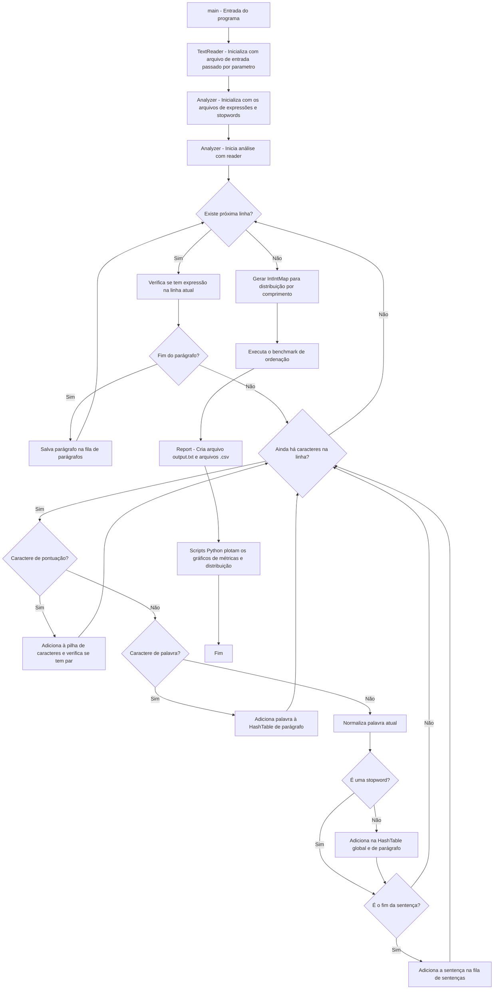

```mermaid
---
config:
  layout: fixed
---
flowchart TB
    A["main - Entrada do programa"] --> B["TextReader - Inicializa com arquivo de entrada passado por parametro"]
    B --> C["Analyzer - Inicializa com os arquivos de expressões e stopwords"]
    C --> D["Analyzer - Inicia análise com reader"]
    D --> E{"Existe próxima linha?"}
    E -- Sim --> F1["Verifica se tem expressão na linha atual"]
    F1 --> F2{"Fim do parágrafo?"}
    F2 -- Sim --> F3["Salva parágrafo na fila de parágrafos"]
    F3 --> E
    F2 -- Não --> F4{"Ainda há caracteres na linha?"}
    F4 -- Sim --> F5{"Caractere de pontuação?"}
    F5 -- Sim --> F6["Adiciona à pilha de caracteres e verifica se tem par"]
    F6 --> F4
    F5 -- Não --> F7{"Caractere de palavra?"}
    F7 -- Sim --> F8["Adiciona palavra à HashTable de parágrafo"]
    F8 --> F4
    F7 -- Não --> F9["Normaliza palavra atual"]
    F9 --> F10{"É uma stopword?"}
    F10 -- Sim --> F11{"É o fim da sentença?"}
    F10 -- Não --> F12["Adiciona na HashTable global e de parágrafo"]
    F12 --> F11
    F11 -- Sim --> F13["Adiciona a sentença na fila de sentenças"]
    F13 --> F4
    F11 -- Não --> F4
    F4 -- Não --> E
    E -- Não --> G["Gerar IntIntMap para distribuição por comprimento"]
    G --> H["Executa o benchmark de ordenação"]
    H --> I["Report - Cria arquivo output.txt e arquivos .csv"]
    I --> J["Scripts Python plotam os gráficos de métricas e distribuição"]
    J --> K["Fim"]
```